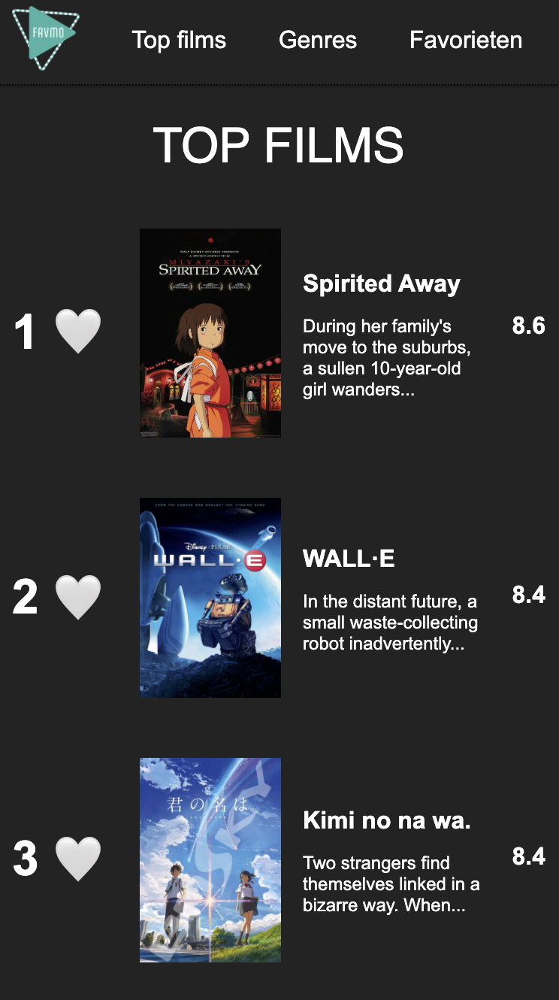

# Frontend voor Designers - opdracht 1: Een Micro-interactie uitwerken en testen

Ontwerp een user interface voor een gegeven use case. Werk je ontwerp uit in HTML, CSS en Javascript om te kunnen testen in een browser.
- Lees hier de [opdrachtbeschrijving](./opdrachtbeschrijving.md).

# Project titel
Ik heb voor usecase 1 gekozen: In een verzameling films wil ik een aantal leuke films kunnen bewaren om ze later te bekijken.

link naar case 1:https://miwi98.github.io/frontend-voor-designers-2021/case-1

Algemene link: https://miwi98.github.io/frontend-voor-designers-2021/

## Interface
Leg de interface uit. In de demo heb je de interface design principles 04 & 11 van [Principles of User Interface Design](http://bokardo.com/principles-of-user-interface-design/) toegepast. Hoe heb je dat gedaan? 
__Uitleg website__: Bij de website Favmo kan de gebruiker films toevoegen aan zijn of haar favorieten en kan de gebruiker scrollen door verschillende pagina's om deze favorieten lijst uit tebreiden.

__Keep users in control__, Mensen voelen zich het meest comfortabel als ze in controle zijn van zichzelf of hun omgeving:
  Ik laat de gebruiker in controle over het hartje favorieten of uit de favorieten te halen doordat de gebruiker er opnieuw op kan  klikken. 

__Strong visual hierarchies work best__, Visuele hiërarchie is het principe van hoe je elementen rangschikt op volgorde van belangrijkheid en dit vervolgens ook zo toont:
  Dit is te zien aan de films en de achtergrond die de nadruk legt op de witte tekst en de afbeeldingen. Op deze manier wordt je geleid door de pagina.

## Code
Ik ben begonnen met de html en de css te maken. dit ging redelijk voorspoedig met wat uitlijning probleempjes die ik in het volgende stadium heb opgelost. 
Ik ben daarna begonnen met het maken van de javascript: ik roep in regel 1 de variable op van de button hearts. daaronder heb ik een for loop gebruikt. ik heb de h gebruikt van hearts. het begint bij 0 en telt daarne elke keer na hoeveel er staan/ te lezen is in de code (hearts). en zet daar doormiddel van een eventlistener de function favorieten op. Vervolgens bij die function moet het ervoor zorgen dat de harten groen of wit worden. beschrijven in javascript file hoe dat werkt.  Tijdens de 2de week kwam ik er achter dat je twee keer moest drukken op een hartje de eerste keer voordat het hartje de groene kleur kreeg. Na het vragen in de groep kwam ik er zelf achter na wat proberen dat het lag aan dat ik een spatie had gebruikt in mijn javascript wat niet hoorde. Nadat ik die spaties had weg gehaald werden de hartjes na 1 keer klikken al groen! mysterie ontraveld.  

## Screenshot van de verschillende versies:
### Versie 1: 
    

### Versie 2:
    

## Bronnen
emojis: https://www.kirupa.com/html5/emoji.htm
groen hart: https://emojiguide.org/green-heart
wit hart: https://emojiguide.org/white-heart
favorite adden: https://codepen.io/shooft/pen/eYZVNyj
double click: https://developer.mozilla.org/en-US/docs/Web/API/Element/dblclick_event
for loop array: https://developer.mozilla.org/en-US/docs/Web/JavaScript/Reference/Statements/for...of