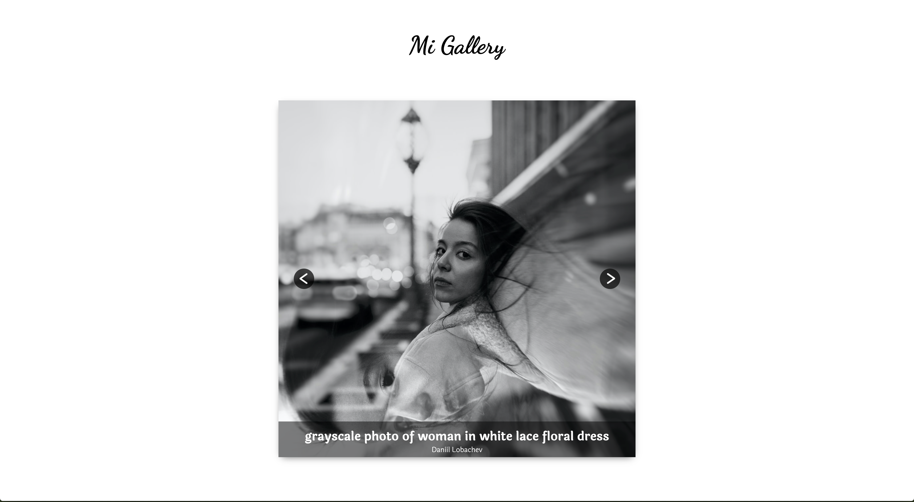

# Frontend voor Designers - opdracht 3: Een interactie uitwerken met externe data

Voor deze opdracht ga je een functionaliteit ontwerpen met externe data. De data is JSON die met een [REST API](https://developer.mozilla.org/en-US/docs/Glossary/REST) van een externe bron wordt ingeladen met Javascript. Als de data geladen is moeten gebruikers je ontwerp op verschillende manieren kunnen bedienen. Verschillende states zijn vormgeven en worden op het juiste moment getoond.

Lees hier de [opdrachtbeschrijving](./opdrachtbeschrijving.md).

# Mi-Gallery
Ik heb een galerij gemaakt met foto's deze foto's worden ingeladen doormiddel van de Api Unsplash. Ik heb random images ingeladen van deze api.  
https://miwi98.github.io/frontend-voor-designers-2021/opdracht3/case-3_v3/

## Interface
Leg de interface uit. In de demo heb je interface design principles 04, 08, 09 & 11 van [Principles of User Interface Design](http://bokardo.com/principles-of-user-interface-design/) toegepast. Hoe heb je dat gedaan?

> 04. Keep users in control - Mensen voelen zich het meest comfortabel als ze in controle zijn van zichzelf of hun omgeving:  
De gebruiker kan doormiddel van de pijltjes toetsen in het toetsenbord de afbeeldingen bekijken en doormiddel van de pijltjes toetsen in de pagina/in het afbeeldings blok.
Op deze manier is gebruiker in controler over het scrollen en bekijken van de afbeeldingen. 

> 09. Appearance follows behavior - Mensen zijn het meest comfortabel met dingen die zich gedragen op de manier die wij verwachten wat het doet: 
Wanneer de gebruiker op een van de pijltjes klikt springt het over naar de volgende afbeelding of wanneer de gebruiker terug klikt gaat het terug naar de vorige afbeelding.
Doormiddel van de pijltjes toetsen op het toetsenbord en in de Mi-gallery pagina naar links of rechts te klikken/drukken gaat de afbeelding naar de volgende of terug naar de vorige afbeelding. 

> 08. Provide a natural next step - Anticipeer op wat de volgende interactie zou moeten zijn om het ontwerp te ondersteunen:  
De geruiker zal de volgende foto willen bekijken en dus verder willen bewegen door de gallerij heen. Het is daarom mogelijk voor de gebruiker om door de klikken door de foto's om er meer te kunnen bekijken.

> 11. Strong visual hierarchies work best - Visuele hiërarchie is het principe van hoe je elementen rangschikt op volgorde van belangrijkheid en dit vervolgens ook zo toont: 
De gebruiker word gemakkelijk gefocust op de gallerij omdat het middenin in het scherm staat. In de gallerij met foto's§ staat er onderin met een zwart balke de titel van de afbeelding en de naam van de auteur. Zodat de gebruiker kan zien wat de titel is van de foto en wie de foto heeft gemaakt. 
 
  
**[UI events] Hoe heb je dat gedaan? **
De UI events die ik heb toegepast zijn click event en keyboard event. 
* *Click event*  - door op de pijltjes de klikken op de pagina kan je naar de volgende foto gaan. Hoe heb ik dit gedaan:
  `nextSlide.onclick = function () {
  next("next"); // volgende slide
} ` 
dit de code dit werkt voor de click methode in de afbeelding ik heb 2 on click functions gemaakt die naar de next of naar de prev slide/image gaan. deze is onclick function wordt aangeroepen met de function next. hierin geeft het aan om hoeveel slides/images het gaat en zal door die afbeeldingen heen gaan.  
* *Keyboard event* - door op de arrow left or right key te drukken op het toestsen kan je door de afbeeldingen heen gaan op de Mi-Gallery pagina. 
Dit heb ik gedaan doormiddel van op te zoeken wat de keycodes zijn van die toetsen en daarvan en eventlisteren te maken en dat te verbinden aan elkaar.
  

## **Code**
Ik heb in Mi-gallery een galerij met foto's gemaakt. Deze foto's worden ingeladen doormiddel van de api Unsplash. Deze foto's worden gevonden doormiddel van mijn acceskey/ client id. Hiermee kan ik requests opvragen naar de foto's. Hiervoor heb ik een account moeten maken bij Unsplash. De galerij heb ik gemaakt doormiddel van een container te maken in de div en daarin de css de styling toegepast. Vervolgens heb ik de pijltjes knoppen gemaakt in de html en daaraan heb ik ook een styling aangegeven in de css. Vervolgens heb ik afbeeldingen gemaakt voor de pijltjes knoppen en die daarin geplaatst. Daarna ben ik begonnen met de javascript en heb ik de pijltjes knoppen een var gegeven en een function zodat ze kunnen klikken naar de volgende of vorige foto. Ook heb ik de pijltjes knoppen een functie gegeven zodat ze ook te bedienen zijn met de pijltjes toetsen op het toetsenbord(keycodes, 37 en 39) van de gebruiker. Aan het einde heb ik de api toegevoegd in de javascript. Dit heb ik gedaan met een client id zoals hierboven beschreven.
De afbeeldingen worden per refresh per 4, random images ingeladen in de pagina. Op deze manier heb je elke keer per refresh van de pagina verschillende foto's die de gebruiker kan zien. Om ook de titel en auteur te laten zien heb ik daarvoor ook create element gebruikt en heb ik vervolgens op deze manier de create element toegepast.  
`let text = document.createElement("div"); 
  text.className = 'caption'; 
  text.innerHTML = imageData.alt_description;`

## **Breakdown Schets**
 

-Feedback Breakdown schets van Koop Reynders:
Ik zie dat je de techniek van de pagina al een beetje hebt uitgedacht. Als je met JSON data gaat werken moet je in Javascript de HTML aanmaken, probeer daarom goed te bedenken hoe de HTML van de carousel eruit komt te zien. 
Wat voor data zit daar in de API die je gaat gebruiken?
Welke UI events ga je toepassen? De click natuurlijk, maar welke nog meer?

_ De data die te zien is in het console is de auteur, titel, likes en nog veel meer. 
De data wat ik wil tonen is de titel en de auteur van de afbeelding.
 _Ik ga de click toepassen en de pijltjes toetsen. de right arrow en de left arrow.   

### **Verschillende versies/fases van mijn Mi-Gallery pagina**
Dit is de eerste versie hierbij werken de knoppen en de pijltjes toetsen om de slides te bewegen. 
  

Dit is versie 2, hierbij heb ik de afbeelding erin geladen gekregen. 
  

Dit is Versie 3, Hierbij is het gelukt op de alt description en de naam van de gebruiker er in te krijgen. 
  

## Bronnen
slider: https://www.youtube.com/watch?v=6fivjkF9BOo  
Using the Unsplash API : https://www.pluralsight.com/guides/using-the-unsplash-api & https://github.com/unsplash/unsplash-js  
unsplash : https://unsplash.com/documentation#list-photos & https://unsplash.com/oauth/applications/215599  
arrow keys: https://forum.webflow.com/t/use-arrow-key-to-change-slides/98069 & http://www.menucool.com/2447/How-can-I-enable-keyboard-left-and-right-keys-to-navigate-the-image-slider  
fetch: https://developer.mozilla.org/en-US/docs/Web/API/Fetch_API/Using_Fetch https://developer.mozilla.org/en-US/docs/Web/API/Fetch_API/Using_Fetch
  
HTML DOM createElement(): https://www.w3schools.com/jsref/met_document_createelement.asp & https://developer.mozilla.org/en-US/docs/Web/API/Document/createElement  
Splash random image: https://unsplash.com/documentation#get-a-random-photo  
appendchild: https://developer.mozilla.org/en-US/docs/Web/API/Node/appendChild  
readme: https://docs.github.com/en/github/writing-on-github/basic-writing-and-formatting-syntax